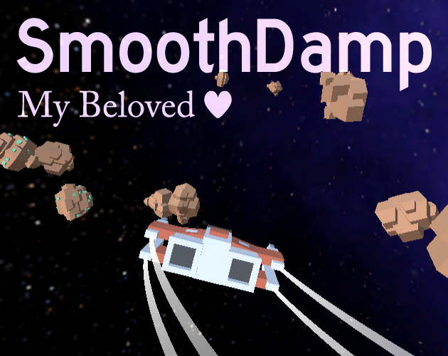

# SmoothDamp Example

This is a playable WebGL Unity project to demonstrate how powerful some simple SmoothDamping can be in making a game feel so much better to control.

### [Play this on the web browser on itch.io!](https://why485.itch.io/smoothdamp-example)

The itch.io page has much more information on what this whole thing is about, so please check out the above link for more info.
